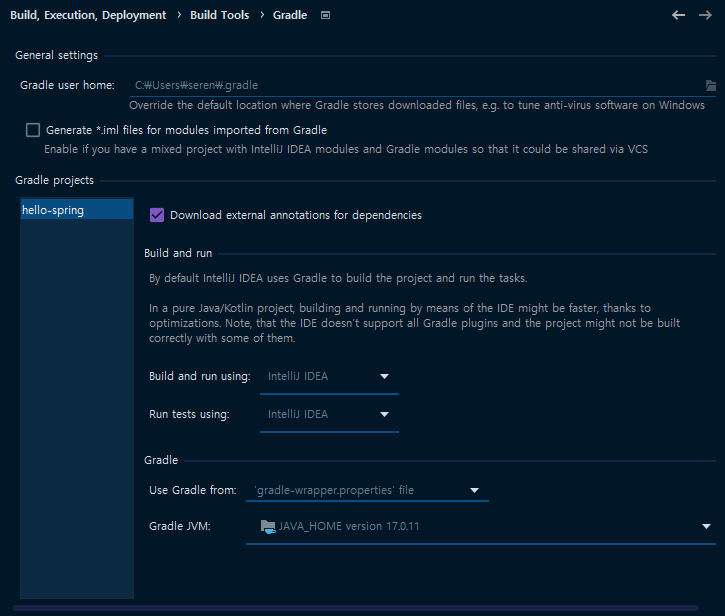

# 프로젝트 생성

## Java 17 설치

1. Oracle JDK 17 설치 : [oracle-jdk17-windows](https://www.oracle.com/java/technologies/downloads/#jdk17-windows)
2. 환경 변수 설정 : `설정 - 시스템 - 정보 - 고급 시스템 설정 - 환경 변수 - 시스템 변수`
   1. `JAVA_HOME` : `C:\Program Files\Java\jdk-17` 새로 만들기
   2. `Path` : `%JAVA_HOME%\bin` 편집 & 추가
   
## Spring Boot 프로젝트 생성 

[start.spring.io](https://start.spring.io/) 사이트를 사용하여 Spring Boot 프로젝트 생성
```text
- Project : Gradle - Groovy
- Language : Java
- Spring Boot : 3.3.0
- Project Metadata : Group (hello) / Artifact (hello-spring)
- Packaging : Jar
- Java : 17
- Dependencies : Spring Web, Thymeleaf
```
> * Spring Web : 웹 애플리케이션 개발을 위한 기능 제공
> * Thymeleaf : Java 기반의 템플릿 엔진

#### Spring vs. Spring Boot
Spring & Spring Boot : Java 기반의 프레임워크
- Spring : 전통적인 설정 방식 → 많은 설정 필요 == 복잡한 초기 설정
- Spring Boot : Spring 프레임워크를 쉽게 사용할 수 있도록 지원
  - 애플리케이션 설정 자동화 → 간단한 초기 설정
    - 데이터베이스 설정 (JDBC), 웹 서버 설정 (내장 Tomcat), Security 설정 
  - `spring-boot-starter` 지원

#### Maven vs.Gradle
Maven & Gradle : 프로젝트 관리 및 빌드 도구

| | Maven | Gradle |
| --- | --- | --- |
| 빌드 스크립트 언어 | XML | Groovy / Kotlin |
| 설정 파일 | `pom.xml` | `build.gradle` / `build.gradle.kts` |

#### IntelliJ 빌드 설정

`File > Settings > Build, Execution, Deployment > Build Tools > Gradle`

- Build and Run
  - `Build and Run using` : 프로젝트를 빌드하고 실행하는 데 사용할 도구 선택
    - ✅ `IntelliJ IDEA`  → 빠른 빌드 (변경된 부분만 빌드 + 빌드 캐시 == 최소한의 빌드!)
    - `Gradle` : 일관된 빌드 환경을 제공하므로 CI/CD 환경에서 유용
  - `Run tests using` : 프로젝트를 테스트할 때 사용할 도구 선택
    - ✅ `IntelliJ IDEA` → 빠른 테스트 (변경된 부분만 테스트 + 테스트 캐시 == 최소한의 테스트!)
    - `Gradle` : 일관된 테스트 환경을 제공하므로 CI/CD 환경에서 유용
- Gradle
  - `Use Gradle from` : Gradle 빌드할 때 사용할 Gradle 설치 위치 지정
    - `gradle-wrapper.properties` : 프로젝트 파일에 정의된 Gradle 버전 사용
  - `Gradle JVM` : Gradle 빌드할 때 사용할 JVM 지정

#### 라이브러리
Spring Boot는 애플리케이션 개발을 간소화하기 위해 다양한 starter 라이브러리를 제공한다.
> starter 라이브러리 : OO에 필요한 모든 의존성을 포함하는 라이브러리 모음

- spring-boot-starter : Spring Boot 애플리케이션 의존성 포함
  - `spring-boot`
    - `spring-core` : Spring 프레임워크의 핵심 기능 제공
  - spring-boot-starter-logging : 로깅에 필요한 의존성 포함
    - `logback` : 로깅 프레임워크
    - `slf4j` : (simple logging facade for Java) 로깅 프레임워크 추상화 계층 제공
- spring-boot-starter-web : 웹 애플리케이션 의존성 포함
  - spring-boot-starter-tomcat : Tomcat에 필요한 의존성 포함
  - `spring-webmvc`
- spring-boot-starter-thymeleaf : 템플릿 엔진을 사용하여 뷰를 렌더링하는 데 필요한 의존성 포함
- spring-boot-starter-test : 테스트에 필요한 의존성 포함
  - `junit` : Java용 단위 테스트 프레임워크
  - `mockito` : mock 객체 생성 및 관리 기능 제공
  - `assertj` : 어서션 기능 제공
  - `spring-test` : Spring 애플리케이션 테스트 환경 제공

## view
view : 클라이언트에게 데이터를 보여주기 위한 화면
- Spring Boot는 `src/main/resources/static` 디렉토리 내의 파일들을 정적 자원으로 간주한다.
- Spring Boot는 요청된 URL에 해당하는 정적 파일이 `static` 디렉토리에 없으면, 기본적으로 제공하는 에러 페이지를 보여준다.
- 템플릿 엔진을 사용하면, 템플릿 파일을 이용하여 동적인 웹 페이지를 생성할 수 있다. (ex. JSP, Thymeleaf)
>`index.html`은 루트 URL 요청 시 보여지는 화면이다. 이는 여러 프레임워크에서 공통적으로 따르는 암묵적인 규칙이다. 

#### view 요청-응답 과정
1. 웹 브라우저가 HTTP 요청을 서버로 전송한다.
2. Tomcat이 HTTP 요청을 수신하고 적절한 컨트롤러로 전달한다.
3. 컨트롤러는 비즈니스 로직을 실행하고, 모델에 데이터를 추가하여 view 이름을 반환한다.
4. viewResolver는 view 이름을 실제 템플릿 파일로 매핑하고 템플릿 엔진을 사용하여 모델 데이터를 포함한 최종 HTML을 생성한다.
5. 생성된 HTML을 전달하고 이를 웹 브라우저가 렌더링한다.