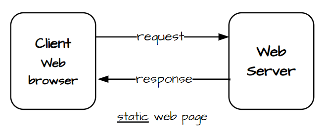
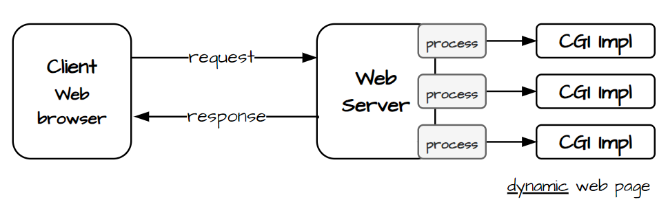
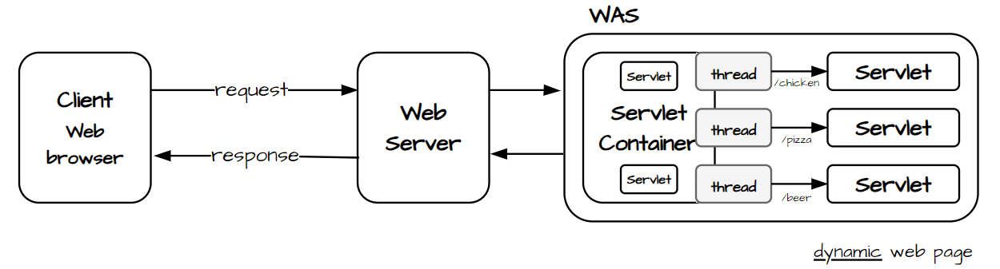
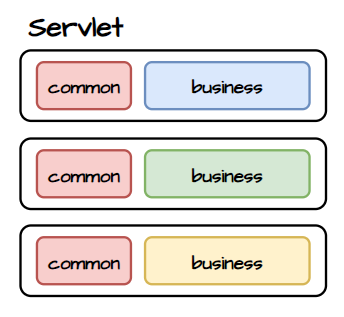
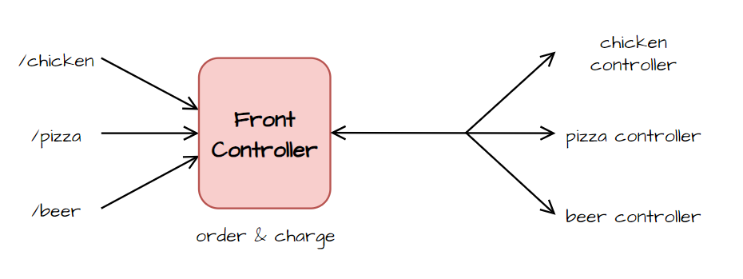
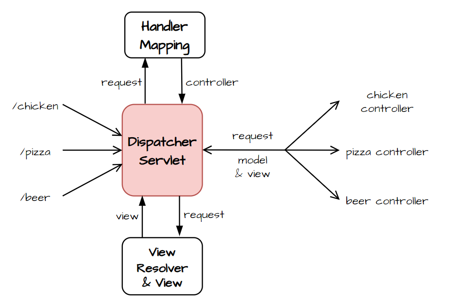

# Background
## Spring Web MVC

servlet 기반 웹 프레임워크
- Spring에 있는 : `spring-webmvc`
- Web 서비스를 만드는
- MVC 패턴을 사용하는
    - Model : 애플리케이션 데이터
    - View : 사용자에게 보여지는 화면 구성 (ex. 템플릿 엔진)
    - Controller : HTTP 요청 처리 `@RestController`

### servlet
[servlet](https://javaee.github.io/tutorial/servlets001.html#BNAFE) : HTTP 요청과 응답을 처리하는 서버 측 컴포넌트

#### servlet 등장 배경
- 초창기 웹 어플리케이션은 정적인 콘텐츠만 제공할 수 있었다. 
  - `클라이언트 ↔ 웹 서버`
  - 😥 사용자 맞춤형 서비스를 제공할 수 없다.
- 동적인 콘텐츠를 제공하기 위해 CGI(Common Gate Interface)가 등장했다. 
  - `클라이언트 ↔ 웹 서버 ↔ CGI 프로그램`
  - 웹 서버는 클라이언트로부터 받은 요청을 CGI 프로그램에 전달하고, CGI 프로그램은 요청을 처리하고 동적인 콘텐츠를 생성하여 웹 서버로 전달한다.
  - 😥 요청마다 새로운 프로세스 생성 → 자원 소모 + (프로세스 생성•종료로 인한) 성능 저하
- CGI의 한계를 극복한 servlet이 등장했다.
  - 프로세스 대신 스레드 생성 → 자원 효율적으로 사용

| static | dynamic with CGI | dynamic with servlet |
| --- | --- | --- |
|  |  |  |

#### 🛠️ servlet 동작 과정

```text
클라이언트 ↔ 웹 서버 ↔ servlet container
```
1. 클라이언트 요청이 웹 서버(Tomcat)로 전달된다.
2. 웹 서버는 요청을 servlet container로 전달한다.
3. servlet container는 요청을 처리할 servlet을 생성하거나, 이미 생성된 servlet을 사용한다.
4. servlet container는 스레드를 생성하고, 생성된 스레드는 servlet의 메서드를 호출하여 HTTP 요청을 처리하고 응답을 생성한다.
5. servlet container는 응답을 웹 서버로 전달한다.
6. 웹 서버는 클라이언트에게 응답을 전달한다.

> servlet container
>- servlet 생명 주기 관리 : 생성 / 초기화 `init()` / 서비스 `service()` / 소멸 `destroy()`
>  - servlet 재사용 → 비용 절감 & 성능 향상
>- 스레드 관리

> servlet : servlet container = DB connection : DB connection pool 

### front controller pattern

모든 요청을 단일 컨트롤러에서 처리하는 SW 디자인 패턴
- single entry point : 모든 요청은 하나의 front controller를 통해 들어온다.
- request dispatching : front controller는 요청(= URL)을 분석하여 적절한 컨트롤러로 전달한다.
- common processing : 다른 컨트롤러로 요청을 전달하기 전에 공통적으로 수행해야 하는 작업을 처리할 수 있다. (ex. 인증)

| servlet의 한계 | front controller pattern | 
| --- | --- |
|  |  |

#### front controller의 업무
- 클라이언트와 서버를 연결한다.
- 요청에 맞는 컨트롤러를 매핑한다.
- 요청이 들어오면 적절한 컨트롤러를 호출한다.
- 응답을 생성하고, 반환한다.
```text
 controller 사전
      ↕ (controller 조회)
front controller ↔ controller
      ↕ (view 검색 & model 데이터 작성)
     view
```

### Spring Web MVC 구조

front controller pattern과 유사한 구조를 갖는다.



[docs.spring.io special-bean-types](https://docs.spring.io/spring-framework/reference/web/webmvc/mvc-servlet/special-bean-types.html)
```text
  HandlerMapping
        ↕ (controller 조회)
DispatcherServlet ↔ HandlerAdapter
        ↕ (view 검색 & model 데이터 담아 응답)
    ViewResolver
```
- `DispatcherServlet` : front controller 역할 수행 
- `HandlerMapping` : 요청 URL을 바탕으로 적절한 컨트롤러(Handler)와 매핑
- `HandlerAdapter` : DispatcherServlet이 찾은 컨트롤러 호출
  - 호환성 제공 → 다양한 유형의 컨트롤러 지원
    - `@RequestMapping` → RequestMappingHandlerAdapter
    - `Controller` 구현체 → SimpleControllerHandlerAdapter
    - `HttpRequestHandler` 구현체 → HttpRequestHandlerAdapter
- `ViewResolver` : 컨트롤러가 반환한 view 이름을 실제 view로 변환

→ 관심사의 분리

<br/>

# 정적 콘텐츠
[docs.spring.io static-content](https://docs.spring.io/spring-boot/reference/web/servlet.html#web.servlet.spring-mvc.static-content)

Spring Boot는 기본적으로 `/static`, `/public`, `/resource` 디렉토리에서 정적 콘텐츠를 제공한다.

### How to serve

1. 클라이언트 요청이 웹 서버로 전달된다.
2. 웹 서버는 `DispatcherServlet`에 요청을 전달한다.
`DispatcherServlet`은 정적 콘텐츠를 처리하기 위해 `ResourceHttpRequestHandler`라는 특별한 핸들러로 라우팅한다.
3. `ResourceHttpRequestHandler`는 요청된 URL에 해당하는 파일을 `/static` 디렉토리에서 찾는다.
4. `ResourceHttpRequestHandler`는 찾은 정적 콘텐츠를 곧바로 클라이언트에게 전달한다.

> **ResourceHttpRequestHandler를 사용하는 이유** <br>
> 정적 리소스 직접 제공 → 빠로고 효율적인 응답
 
<br/>

# 템플릿 엔진

```java
@GetMapping("hello-template")
public String helloTemplate(@RequestParam("name") String name, Model model) {
    model.addAttribute("name", name);
    return "hello-template"; // view 이름
}
```

### How to serve

1. 클라이언트 요청이 웹 서버로 전달된다.
2. 웹 서버는 `DispatcherServlet`에 요청을 전달한다.
   `DispatcherServlet`은 적절한 컨트롤러를 찾기 위해 `HandlerMapping`에 요청을 전달한다.
3. `HandlerMapping`은 요청된 URL에 매핑된 컨트롤러를 찾아 `DispatcherServlet`에 전달한다.
4. `DispatcherServlet`은 `HandlerAdapter`를 통해 컨트롤러를 호출하고 model 데이터를 받아온다.
5. `DispatcherServlet`은 `ViewResolver`를 사용하여 view 이름에 해당하는 view를 찾는다.
6. `DispatcherServlet`은 model 데이터를 view에 담아 최종 HTML을 생성하고 클라이언트에게 전달한다.

<br/>

# API

```java
@GetMapping("hello-api")
@ResponseBody
public String helloApi(@RequestParam("name") String name) {
    return "Hello, " + name; // != view 이름
}
```
`@RequestBody`를 사용하는 이유

- 해당 어노테이션이 없으면 `ViewResolver`를 거친다.
- `@ResponseBody`를 통해 컨트롤러의 반환값을 HTTP 응답 본문에 직접 넣어 전달할 수 있다.
  - 객체 반환 → JSON으로 변환 

### How to serve

1. 클라이언트 요청이 웹 서버로 전달된다.
2. 웹 서버는 `DispatcherServlet`에 요청을 전달한다.
   `DispatcherServlet`은 적절한 컨트롤러를 찾기 위해 `HandlerMapping`에 요청을 전달한다.
3. `HandlerMapping`은 요청된 URL에 매핑된 컨트롤러를 찾아 `DispatcherServlet`에 전달한다.
4. `DispatcherServlet`은 `HandlerAdapter`를 통해 컨트롤러를 호출한다.
5. 컨트롤러는 비즈니스 로직을 처리하고 결과를 반환한다.
6. `HttpMessageConverter`는 결과가 적절한 형식으로 변환한다.
  - 문자열 → `StringConverter`
  - 객체 → `JsonConverter`
7. `DispatcherServlet`은 최종 응답을 생성하여 클라이언트에게 전달한다.