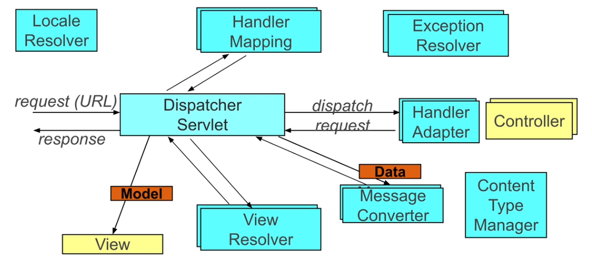

# Spring web application

`spring-boot-starter-web`

## Spring MVC

웹 프레임워크
- Model + View + Controller 패턴
- POJO 프로그래밍
  - POJO (plain old Java object) : 특정 프레임워크/라이브러리에 의존하지 않음 → 코드 재사용성 높음
- 테스트가 가능한 컴포넌트 기반 설계

> Spring Boot는 Spring MVC를 기반으로 웹 어플리케이션을 쉽게 만들 수 있도록 돕는다. (ex. auto configuration, 내장 서버, 의존성 관리)

### types

- web servlet
  - 전통적 (Java EE servlet 기반)
  - servlets : HTTP 요청•응답 처리
  - filters : 요청•응답을 가로채서 추가적인 처리 (ex. 인증, 로깅, 압축)
  - listeners : 특정 servlet container 이벤트 발생 시 실행
    - `HttpSessionListener`, `ServletContextListener`
- web reactive
  - 최신 개발 방식
  - 높은 효율성 → 대량의 요청 동시 처리
  - 비동기 → 자원 효율적 사용 + 빠른 응답 시간

### web servlet components



- locale resolver : 사용자 로케일 결정 → 다국어 지원
- exception resolver : 요청 처리 중 발생하는 예외 처리
- view resolver : controller가 반환한 view 이름 → 실제 view로 변환
- dispatcher servlet : 모든 요청을 받아서 적절한 handler로 전달
- handler mapping : 요청 URL → 적절한 handler(= controller)로 매핑
- handler adapter : 다양한 handler 지원
- controller : 사용자 요청 처리 + 적절한 응답 생성
  - 비즈니스 로직 수행 후 view 반환
- message converter : 요청/응답 형식 → 특정 형식으로 변환
- content type manager : 콘텐츠 타입 관리

> 💡 사용자 요청 처리 순서
> 1. dispatcher servlet이 사용자 요청을 받는다.
> 2. dispatcher servlet은 handler mapping을 사용하여 요청 URL을 적절한 controller로 매핑한다.
> 3. 매핑된 handler를 실행하기 위해 handler adapter를 거친다.
> 4. controller는 사용자 요청을 처리하고 비즈니스 로직을 수행한 후 dispatcher servlet에게 논리적인 view 이름이나 데이터를 반환한다.
> 5. view resolver는 controller가 반환한 view 이름을 실제 view로 변환하여 dispatcher servlet에게 반환한다.
> 6. dispatcher servlet은 최종 응답을 사용자에게 반환한다.

#### how to generate response data

message converter : Java 객체 → 텍스트 형식
  - Spring MVC에서 제공하는 기능
  - 개발자는 Java 객체 사용하여 쉽게 작업 가능 (수동 변환 X)
  - `@ResponseBody` : Java 객체가 message converter를 통해 자동으로 변환되어 HTTP 응답에 포함됨
    - HTTP 요청의 `Accept` 헤더를 바탕으로 적절한 message converter 선택

<br />

# controller

```java
@Controller
public class MemberController {
  
  @GetMapping("/members")
  @ResponseBody
  public List<Member> findAll() { ... }
  ...
}
```

- `@Controller`
- `@ResponseBody` : REST 응답
  - 메서드가 반환하는 응답을 HTTP 응답 본문에 직접 씀 = 반환값을 view 이름으로 해석하지 않음
  - 주로 JSON•XML 형식 사용
  - `@RestController` = `@Controller` + `@ResponseBody`

> controller의 모든 메소드에 동일한 기본 경로를 사용하고 싶을 때는 `@RequestMapping`을 사용한다.
> ```java
> @RestController
> @RequestMapping("/members")
> public class MemberController { ... }
> ```

> Spring은 사용자 요청을 분석하여 자동으로 메소드 인자를 주입한다.
> ```java
> @GetMapping("/search")
> public List<Member> findAllByKeyword(@RequestParam String keyword) { ... }
> 
> @GetMapping("/{id}")
> public Optional<Member> findById(@PathVariable Long id) { ... }
> 
> @PostMapping
> public Member createMember(@RequestBody Member member) { ... }
> ```
> - `@RequestParam(required=[BOOLEAN])`을 통해 필수 여부를 설정할 수 있다. (기본값은 `required=true`)
>   - `defaultValue`를 설정하여 파라미터가 없을 때 사용할 기본값을 지정할 수 있다.
> - 메소드 인자의 이름은 파라미터 변수명, 경로 변수명과 일치해야 한다. 다른 경우에는 `name=[NAME]`으로 명시적으로 매핑할 수 있다.
> - 이외에도 `HttpServletRequest`, `Session`, `Principal` 등이 있다.

> 💡 Spring Boot DevTools : 어플리케이션을 더 빠르고 편리하게 만들기 위한 도구 모음
> - 자동 재시작 : 코드 변경 시 자동 재시작 (nodemon과 유사!)
> - 개발 전용 설정 `developmentOnly` : 프로덕션 환경에서는 자동으로 비활성화
> ```groovy
> dependencies {
>   developmentOnly 'org.springframework.boot:spring-boot-devtools'
> }
> ```