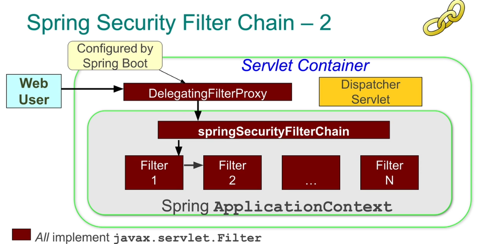

# spring security

## security concepts

- principal : 행위의 주체 (ex. 사용자, 장치, 시스템)
- authentication : principal의 자격 증명이 유효한지 확인
- authorization : principal이 특정 자원에 접근할 수 있는지 확인
- authority : 접근을 허용하는 허가•자격
- secured resource : 보호되는 자원

### authorization

특정 principal이 특정 자원에 접근할 수 있는지 결정하는 과정

- 인증에 의존 == 권한을 부여하기 전에 principal의 신원 확인
- 특정 자원에 접근하기 위한 권한이 있는지 판단
  - 주로 역할 기반 동작

## setup

1. setup filter chain
2. configure security rules
3. setup web authentication

## spring security architecture

애플케이션 보안을 담당하는 프레임워크

- 휴대성 == 어떤 Spring 프로젝트에서도 사용 가능 
- 관심사의 분리
  - 비즈니스 로직과 보안 로직 분리 → 보안이 비즈니스 로직에 영향을 미치지 않음 
  - 인증과 인가의 분리 → 인증 방식의 변경이 인가에 영향을 주지 않음
- 유연성 & 확장성
  - 다양한 인증 방식 지원
    - Basic : HTTP 기존 인증 사용
    - Form : 로그인 폼을 이용한 인증
    - X.509 : 인증서 기반 인증
    - OAuth : OAuth 프로토콜을 사용한 토큰 기반 인증
    - Cookies : 쿠키 → 세션 정보 유지
    - SSO : 한 번의 로그인으로 (single sign on) 여러 시스템 접근
  - 사용자 정보와 권한 정보 저장를 어디에 저장하고 관리할 것인지 다양한 옵션 제공


- authentication manager : 사용자 인증 처리
  - 자격 증명 검증 → 사용자 신원 확인
- authorization manager : 사용자 권환 확인 & 접근 허용•거부
- security context : 애플리케이션 보안 상태를 나타내는 container
  - `Authentication` : Spring Security에서 사용되는 객체 → 현재 인증된 사용자 정보 저장
    - principal : 사용자 정보 (ex. 이름)
    - authorities : 사용자가 가진 권한 목록
- security interceptor : 요청이 자원에 도달하기 전 보안 검사 수행
  - 모든 요청 가로챔 → 인증 및 권한 검사
  - `FilterSecurityInterceptor` : HTTP 요청 인터셉트
  - `MethodSecurityInterceptor` : 메소드 호출 인터셉트
- config attributes : 보안 검사를 수행할 때 필요한 메타데이터
  - security interceptor가 이용
  - 주로 자원에 접근하기 위해 필요한 권한 정보 정의

> 💡 Spring Security 동작 방식
> 1. 사용자 요청이 `SecurityFilterChain`을 통과한다.
>    - Security Filter들이 순차적으로 요청을 처리한다.
>    - 이 과정에서 자격 증명을 추출하여 `Authentication` 객체를 만들고, authentication manager로 전달한다.
> 2. authentication manager은 여러 `AuthenticationProvider`를 사용하여 자격 증명을 검증한다.
>    - 성공 → `Authentication` 객체가 `SecurityContextHolder`에 저장된다.
>    - 실패 → `AuthenticationException` 발생
> 3. security interceptor가 보안 검사를 수행한다.
>    - config attributes를 확인하여 접근 권한을 확인한다. (ex. 특정 URL에 접근하기 위해 필요한 역할)
> 4. authorization manager가 인증된 사용자 권한을 기반으로 요청된 자원에 대한 접근 권한을 확인한다.
>    - config attribute와 `Authentication` 객체를 기반으로 접근 권한을 결정한다.
>    - 허용 → 진행
>    - 거부 → `AccessDeniedException` 발생

### `SecurityFilterChain`



Spring 애플리케이션 보안을 담당하는 일련의 filter로 구성된 체인

- `DelegatingFilterProxy` 사용
  - ApplicationContext 내 보안 필터 검색 + 위임
  - Spring Boot에 의해 자동으로 구성
  - Dispatcher Servlet 전에 수행
- 주요 filter
  1. `SecurityContextPersistenceFilter`
    - HTTP 요청 간 security context 유지•복원
    - 인증 상태 유지 가능
  2. `LogoutFilter`
    - 로그아웃 요청 처리 → `SecurityContextHolder` 비움
  3. `UsernamePasswordAuthenticationFilter`
     - 폼 기반 로그인 요청 처리 → 이름 + 비밀번호를 통한 인증 수행
  3. `BasicAuthenticationFilter`
     - HTTP 기본 인증 헤더 처리 → 이름 + 비밀번호를 통한 인증 수행
  4. `OAuth2AuthenticationProcessingFilter`
     - OAuth2 인증 요청 처리 → 토큰 기반 인증 수행
  5. `ExceptionTranslationFilter`
     - 보안 예외 처리 → 적절한 오류 페이지나 응답 반환
  > 위 filter들은 사용자가 별도로 구성하지 않아도 자동으로 적용되는 기본 filter다.

### `AuthenticaitonProvider` & `UserDetailsService`

#### `AuthenticationProvider`

사용자 자격 증명 검증

- Out-of-the-box `AuthenticationProvider` 구현체
  - `DaoAuthenticationProvider` : 데이터베이스나 메모리 등에서 사용자 정보 조회 후 인증 처리
  - `LdapAuthenticationProvider` : LDAP 서버에서 사용자 정보 조회 후 인증 처리
  - `OpenIDAuthenticationProvider` : OpenID를 사용한 인증 처리
  - `RememberMeAuthenticationProvider` : Remember Me 기능을 사용한 인증 처리

#### `UserDetailsService`

사용자 정보 조회

- `AuthenticationProvider`가 필요한 사용자 세부 정보 제공
- Out-of-the-box `UserDetailsService` 구현체
  - `InMemoryUserDetailsManager`
    ```java
    @Bean
    public InMemoryUserDetailsManager userDetailsService() {
      PasswordEncoder encoder = PasswordEncoderFactories.createDelegatingPasswordEncoder();
    
      UserDetails user = User.withUsername("user").password(passwordEncoder.encode("user")).roles("USER").build();
      UserDetails admin = User.withUserName("admin").password(passwordEncoder.encode("admin")).roles("ADMIN").build();
    
      return new InMemoryUserDetailsManager(user, admin);
    }
    ```
  - `JdbcUserDetailsMan(ager` 
    ```java
    @Bean
    public UserDetailsManager userDetailsManager(DataSource dataSource) {
      return new JdbcUserDetailsManager(dataSource);
    }
    ```
  - `LdapUserDetailsManager`

> 💡 `AuthenticationProvider`와 `UserDetailsService`의 동작 과정
> 1. authentication manager가 인증을 위해 적절한 `AuthenticationProvider`를 호출한다.
> 2. `AuthenticationProvider`은 `UserDetailsService`를 호출하여 사용자 정보를 조회한다.
> 3. 반환 받은 `UserDetails` 객체를 바탕으로 사용자 정보를 비교한다.
> 4. 일치하면 인증 성공, 일치하지 않으면 인증 실패로 간주한다.

### URL authorization

특정 URL 패턴에 대한 접근 권한 제어
- 주로 `HttpSecurity` 이용
  - `HttpSecurity` : HTTP 보안 구성을 정의하는 객체
  - `authorizeHttpRequests()` : HTTP 요청에 대한 접근 권한 설정

```java
@Configuration
public class SecurityConfig {
  @Bean
  public SecurityFilterChain filterChain(HttpSecurity http) throws Exception {
    http.authorizeHttpRequests((auth) -> auth
        .requestMatchers("/admin/**").hasRole("ADMIN")
        .requestMatchers("/signup", "/about").permitAll()
        .requestMatchers("/accounts/**").hasAnyRole("USER", "ADMIN")
        .anyRequest().authenticated());
    return http.build();
  }
}
```

### method security

AOP 사용 → 메소드 수준 보안 제공
- 메소드 호출 전후에 보안 검사 수행 : `@PreAuthorize`,`@PostAuthorize`
- 특정 역할이 있는 사용자만 허용 : `@Secured`(Spring Security), `@RolesAllowed`(JSR-250)

```java
@EnableMethodSecurity // for configuration
```
```java
@PreAuthorize("hasRole('ADMIN')")
public void adminMethod() { ... }

@Secured("ROLE_USER")
public void userMethod() { ... }
```

> `@Secured("ROLE_USER")` vs. `@PreAuthorize("hasRole('USER'))")`
> - `@Secured("ROLE_USER")` : 역할 기반 간단한 접근 제어
>   - `ROLE_` 접두사 필요
> - `@PreAuthorize("hasRole('USER'))")` : spEL을 사용하여 더 복잡•세밀한 접근 제어 가능