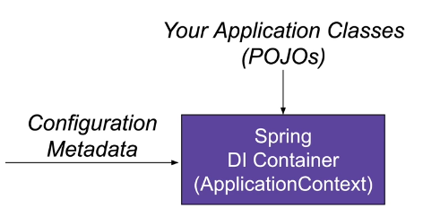

# Spring configuration style



- configuration metadata
    - `BeanDefinition` (타입, 이름, 스코프 등)
      - bean 이름 기본값 = 메소드 이름
      - `@Bean(name="[NAME]")`으로 직접 부여 가능
    - 의존성 설정 : 해당 bean이 의존하는 다른 bean

## Java-based configuration

`@Bean`이 붙은 메소드를 포함하는 `@Configuration` 클래스

```java

@Configuration
public class ApplicationConfig {

  @Bean
  public MemberService memberService() {
    return new MemberServiceImpl(memberRepository());
  }

  @Bean
  public MemberRepository memberRepository() {
    return new JdbcMemberRepository(dataSource());
  }

  @Bean
  public DataSource dataSource() {
    ...
    return dataSource;
  }
}
```

> 😎 Spring Boot의 `application.properties`를 작성하면 `DataSource` bean을 자동으로 등록할 수 있다!

### `application.properties`

Spring Boot에서 애플리케이션 설정을 관리하는 데 사용하는 파일

- auto configuration
    - ex. `DataSource` bean 자동 등록
        - Spring Boot의 `DataSourceAutoConfiguration` 클래스의 지원
            - `@ConditionOnProperty` 어노테이션 : property 값에 따른 bean 생성
                - `@ConditionalOnProperty(prefix = "spring.datasource", name = "url")`
                - `spring.datasource` prefix 존재 → `DataSource` bean 생성


### application context from multiple configurations

`@Import`를 통해 다른 configuration 포함

```java
@Configuration
@Import(ApplicationConfig.class)
public class InfrastructureConfig { ... }
```

### 

<br />

# application context

[docs.spring.io spring IoC container](https://docs.spring.io/spring-framework/reference/core/beans/introduction.html)

- Spring IoC container : bean의 생성 및 관리 담당 컨테이너
  - ex. `BeanFactory`, `ApplicationContext`
- `ApplicationContext` = `BeanFactory` 모든 기능 + 부가 기능
    - 부가 기능 : `MessageSource`, `ApplicationEventPublisher` 등

(Spring 애플리케이션 실행 : `ApplicationContext context = SpringApplication.run(ApplicationConfig.class);`)

1. bean 조회 : bean 이름•타입을 통해 bean 정의 조회
    - ex. `context.getBean("MemberService", MemberService.class)`
2. bean 생성 여부 확인
    - 싱글톤의 경우, 요청된 bean이 이미 생성되어 있는지 확인
3. bean 인스턴스화
4. bean에 필요한 의존성 주입
5. bean 초기화
6. bean 반환

> bean 조회 방법
>1. 아이디로 조회
>2. 타입으로 조회
>3. 아이디와 타입으로 조회

<br />

# Bean 스코프
1. singleton : (기본값) `@Bean` == `@Bean @Scope("singleton")`
2. prototype : `@Scope("prototype")`
3. session : (web only) `@Scope("session")` 
4. request : (web only) `@Scope("request")`